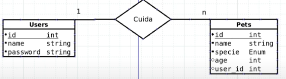
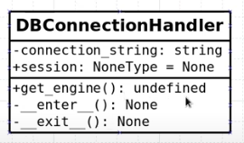

# Clean Architecture Python

## links importantes

- clean Architecture: <https://blog.cleancoder.com/uncle-bob/2014/10/01/CleanMicroserviceArchitecture.html>
- Playlist do prgramador Lhama: <https://www.youtube.com/watch?v=YAMgtR3aCuY&list=PLAgbpJQADBGJmTxeRZKWvdJAoJj8_x3si>
- PEP8: <https://peps.python.org/pep-0008/#indentation>
- Pytest: <https://docs.pytest.org/en/stable/>
- FLAKE8: <https://flake8.pycqa.org/en/latest/user/error-codes.html>
- pre-commit: <https://pre-commit.com/>

## Configuração inicial dos projetos em python

- Video de explicação das configuraçoes: <https://www.youtube.com/watch?v=E81JDPXvwwQ&t=70s>

## Banco de Dados e Camada de Infraestrutura

Diagrama de relacionamento

## dependencia e instalacao

- pip install pylint
- pylint --generate-rcfile > .pylintrc
- pip3 install black
- pip3 install flake8
- pip install pre-commit